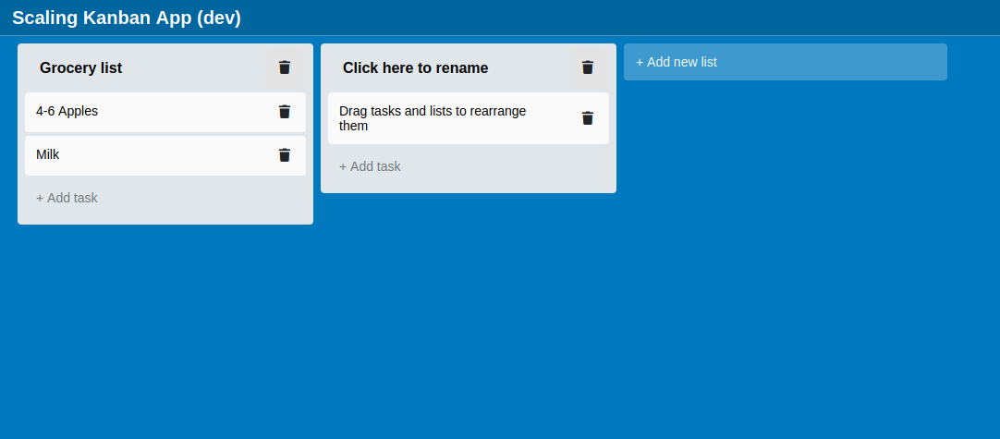

# Scaling Kanban Prototype

This project is a prototype of a scaling architecture for a collaborative Kanban web app with live updates via websockets.

## Why?

I did this to gain more experience with technologies I was curious about:
- Docker compose
- Rust backend
- Websockets
- Pub/Sub 
- Distributing load between multiple backends

*I did not create unit tests as this is just a small prototype*

## How to run
1. Clone the repository.
2. Run `run-demo.sh`. This starts all services and 2 backend instances, feel free edit the file to use a higher number of backend instances (change `backend=2` to `backend=6` for example).
3. Open http://localhost:3500 and select a board.
4. Open the board in multiple tabs and make changes to the board. The changes should be synchronized between all tabs.
5. The backend logs (`docker compose logs backend -f`) should indicate that multiple backends are serving clients.

# Architecture

I wanted to create a solution that would support editing of the same kanban boards by multiple users across multiple backend instances.

### Reverse proxy & load balancer: Traefik
Was really easy to set up: The configuration is completely inside the docker compose file.
Traefik also reacts to up and down scaling without restarts and the configuration can be inspected via a frontend on http://localhost:8080.

### Backend: Axum (Rust)
Seemed like a good alternative to Actix (it is developed by the Tokio team).

### Frontend: React (TypeScript)
I created this frontend 2 years ago and reused it for this prototype (it still uses `react-beautiful-dnd`).

### Message Service (Pub/Sub): Nats.io
Nats claims to be easy to set up (it was) and I just wanted to try it out.

### Database: MongoDB
I decided to use MongoDB as it is easy to set up and to adjust the data layout.

### This is how it works:
1. **Load balancer** distributes incoming requests for the backend to the available **backend instances** 
2. **Frontend** establishes Websocket connection to a **backend instance** for the current board. The frontend will then receive updates to the board made by other users via this connection.  
3. User changes to the board are sent from **frontend** to a **backend instance** via `PUT` calls
4. **Backend instance** modifies the boards document in the **MongoDB** collection, increments a `version` field and sends updated board in `JSON` response to **frontend**.
5. **Backend instance** then publishes a message to **Pub/Sub** containing the new `JSON` representation of the board
6. **Pub/Sub** distributes the updated kanban board `JSON` representation to all subscribed **backend instances**
7. Subscribed **backend instances** notify connected **frontends** about change to the kanban board via the Websocket connections of step 2
8. All notified **frontends** update their board state if the `version` of the received board is newer
